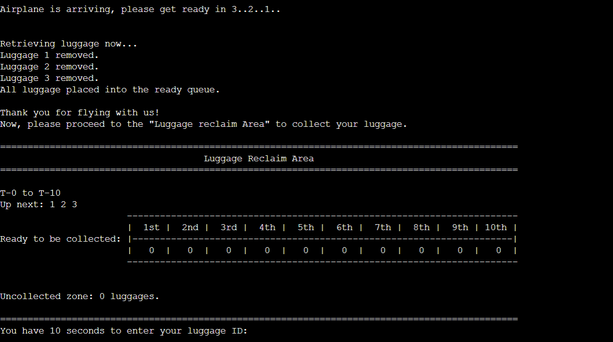

# Luggage-Management-System

The Luggage Management System, developed in C++, addresses the common issue of lost luggage in airports by providing an efficient tracking solution. 
By assigning unique identification codes and implementing real-time monitoring, the system ensures that baggage is accurately recorded, tracked, and managed from check-in to retrieval. This reduces the risk of misplacement, enhances passenger experience, and improves airport efficiency by automating the luggage handling process.

